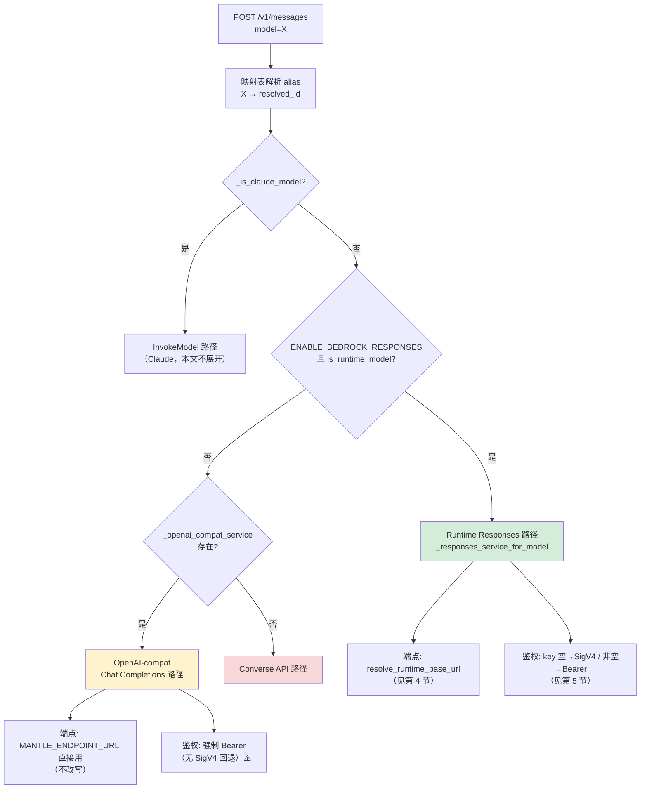
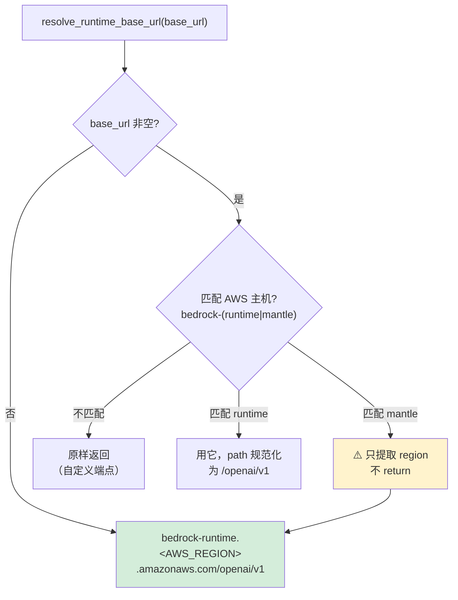

# 请求路径、模型传参、鉴权与环境配置的完整梳理

本文梳理**非 Claude 模型**（如 `openai.gpt-5.x` 系列）在本代理中的完整调用链路：
不同请求路径（`/v1/messages` vs `/openai/v1/*`）、不同 model 传参、不同环境变量组合，
分别对应哪条处理流程、打到哪个上游端点、用什么鉴权方式。

> 结论均基于代码确证（提交 `c75696e` 引入的 `#147 default scoped non-Claude models to Runtime Responses`），
> 而非注释推断。关键代码位置在每节标注，便于后续 debug 时回溯核实。
>
> Claude 模型走 InvokeModel（SigV4 原生）路径，不在本文范围；Claude 路径的 beta header
> 处理规则见 `bedrock_service.py:674-698`（blocklist/mapping/passthrough）。

---

## 1. 两条请求路径

代理对外暴露两套入口，**互相独立**，各有一套 body 处理逻辑：

| 入口 | 输入格式 | 用途 | 挂载开关 |
|------|---------|------|---------|
| `POST /v1/messages` | **Anthropic Messages 格式** | Anthropic SDK / Claude Code 客户端 | 始终挂载 |
| `POST /openai/v1/responses`（及 `/chat/completions` 等） | **OpenAI 原生格式** | OpenAI SDK 客户端 | 仅 `ENABLE_OPENAI_PASSTHROUGH=True` |

两条路**都会查模型映射表解析 alias**，**都支持 SigV4 自动回退**，**都用同一个 `clamp_reasoning_effort`**。
核心差异在 **body 转换**：`/v1/messages` 需把 Anthropic 格式翻译成 Responses 格式；
`/openai/v1/*` 输入已是原生格式，只做参数矫正、不翻译。详见第 7 节。

---

## 2. model 传参与 `is_runtime_model` 判定

**一切路由决策的起点，是 model ID 经映射表解析后，是否满足 `is_runtime_model`。**

### 2.1 `is_runtime_model` 判定规则

代码：`app/services/bedrock_openai.py:27-37`

```python
def is_runtime_model(model: str) -> bool:
    lowered = model.lower()
    return (
        lowered.split(".", 1)[0] in REGION_PREFIXES   # 第一段是 region 前缀
        and len(lowered.split(".")) >= 3               # 至少 3 段
        and "anthropic" not in lowered                 # 非 Claude
        and "claude" not in lowered
    )
```

`REGION_PREFIXES`（`bedrock_openai.py:18-19`）：
```
{global, us, us-gov, eu, apac, ca, sa, af, me, cn}
```

判定示例：

| model ID | 第一段 | 段数 | is_runtime_model | 说明 |
|----------|-------|------|:---:|------|
| `us.openai.gpt-5.6-luna` | `us` ✅ | 3 ✅ | **True** | scoped，走 Runtime Responses |
| `global.openai.gpt-oss-120b` | `global` ✅ | 3 ✅ | **True** | scoped |
| `openai.gpt-5.6-luna` | `openai` ❌ | 2 | **False** | `openai` 不是 region 前缀 |
| `gpt-5.6-luna` | `gpt-5-6-luna` ❌ | 1 | **False** | 无前缀 |
| `us.anthropic.claude-...` | `us` ✅ | 3 | **False** | 含 `claude`，是 Claude 路径 |

**关键：`openai.` 前缀不满足条件**（`openai` 不在 region 前缀集合里），
只有 `us.openai.` / `global.openai.` 这类 **region-scoped** ID 才是 runtime model。

### 2.2 alias 解析：让短名变成 scoped ID

两条路径都通过模型映射表把客户端传入的短名解析成真实 ID：

- `/v1/messages`：解析发生在 `messages.py`（日志 `resolved model alias 'X' -> 'Y'`）
- `/openai/v1/*`：解析发生在 `resolve_model_id`（`app/api/openai_passthrough/model_mapping.py:15-33`，`router.py:314/462` 调用）

`resolve_model_id` 优先级：**DynamoDB 映射表 > `settings.default_model_mapping` > 原样返回**。

**因此：只要在映射表配一条 `短名 → us.openai.xxx`，两条路径都能传短名，且解析后满足 `is_runtime_model`。**

配置方式（三选一）：

```bash
# 方式 A：脚本
uv run scripts/manage_model_mapping.py add \
  --anthropic-id "gpt-5.6" \
  --bedrock-id "us.openai.gpt-5.6-luna"

# 方式 B：直写 DynamoDB
AWS_REGION=us-west-2 aws dynamodb put-item \
  --table-name anthropic-proxy-model-mapping \
  --endpoint-url http://<your-dynamodb>:8001 \
  --item '{"anthropic_model_id":{"S":"gpt-5.6"},"bedrock_model_id":{"S":"us.openai.gpt-5.6-luna"}}'

# 方式 C：Admin 前端 Model Mapping 页新增

# 验证解析
uv run scripts/manage_model_mapping.py test --anthropic-id "gpt-5.6"
```

字段含义：`anthropic_model_id` = 客户端传入的短名（alias），`bedrock_model_id` = 解析目标。
**未配 alias 的短名不会自动变 scoped**，会 pass-through 原样，`is_runtime_model` 判 False 走别的路。

---

## 3. `/v1/messages` 路由决策

代码：`app/services/bedrock_service.py:_openai_route(252-263)` → `_responses_service_for_model(188-250)`



**三条子路径对比：**

| 子路径 | 触发条件 | 端点 | 鉴权 | 无 key 能跑? |
|--------|---------|------|------|:---:|
| **Runtime Responses** | `ENABLE_BEDROCK_RESPONSES=True` 且 resolved_id 是 runtime model | `bedrock-runtime.<region>`（改写后） | key 空→SigV4；非空→Bearer | ✅ |
| **OpenAI-compat** | 非 runtime model 且 compat service 已建 | `MANTLE_ENDPOINT_URL` 原样 | **强制 Bearer** | ❌ |
| **Converse** | 以上都不满足 | Bedrock Converse | SigV4 | model 需 Converse 支持 |

> compat service 建立条件（`bedrock_service.py:174`）：
> `use_global = enable_openai_compat and openai_api_key and openai_base_url` ——
> **三者都非空**才建。清空 `BEDROCK_API_KEY` 后 compat service 根本不存在，
> 非 runtime model 会落到 Converse。

---

## 4. 端点解析：mantle 主机被改写成 runtime

代码：`app/services/bedrock_openai.py:resolve_runtime_base_url(45-67)`

**这是最反直觉的一点：配置 `MANTLE_ENDPOINT_URL` 指向 mantle 主机，
在 Runtime Responses 路径上会被主动改写成 `bedrock-runtime` 主机。**



端点决策真值表（Runtime Responses 路径）：

| `MANTLE_ENDPOINT_URL` | 最终端点 |
|----------------------|---------|
| 空 | `bedrock-runtime.<AWS_REGION>.amazonaws.com/openai/v1` |
| `bedrock-mantle.<region>.api.aws/...` | **改写为** `bedrock-runtime.<region>.amazonaws.com/openai/v1` |
| `bedrock-runtime.<region>.amazonaws.com/...` | 用它（path 规范化到 `/openai/v1`） |
| 自定义非 AWS 主机 | 原样用 |

**结论：Runtime Responses 路径上几乎总是打到 `bedrock-runtime` 端点，不会真打到 mantle。**

> 日志里的 `[OPENAI-COMPAT] Initialized with endpoint=override` 只是个来源标签
> （`openai_compat_service.py:109`：`"override" if base_url else "settings"`），
> **表示"构造时传了 base_url"，不代表最终 URL 是 mantle**。别被这行日志误导。

> 注意 OpenAI-compat 子路径（第 3 节）**不经过** `resolve_runtime_base_url`，
> 而是 `resolved_base_url = base_url or settings.openai_base_url`
> （`openai_compat_service.py:95`）——**直接用 `MANTLE_ENDPOINT_URL`，不改写**。
> 这是两条子路径的关键区别。

---

## 5. 鉴权：SigV4 自动回退 vs Bearer

代码：`app/services/bedrock_service.py:204-243`（Runtime Responses 路径）

```python
api_key = (
    self._openai_api_key_override           # 多 provider override（一般为空）
    or settings.openai_api_key              # = BEDROCK_API_KEY（config.py:550 alias）
    or os.environ.get("AWS_BEARER_TOKEN_BEDROCK")
)
...
if not api_key and credentials is None:
    credentials = self.client._request_signer._credentials    # 取 boto3 client 的 AK/SK
...
if not api_key:                                                # api_key 为空
    kwargs["api_key"] = "aws-sigv4"                            # 占位
    kwargs["http_client"] = httpx.Client(
        auth=BedrockSigV4Auth(credentials, region))            # SigV4 签名
```

**鉴权分支只看 `api_key`（即 `BEDROCK_API_KEY`）是否为空：**

| `BEDROCK_API_KEY` | 鉴权方式 | 说明 |
|-------------------|---------|------|
| **空** | **SigV4**（用 `.env` 的 AK/SK，或 ECS task role） | 无需任何长期密钥 |
| **非空**（即使无效） | Bearer token | 非空即走 Bearer，**不回退 SigV4**；无效 key → 上游 401 |

> ⚠️ **一个非空但无效的 `BEDROCK_API_KEY` 会让请求走 Bearer 分支被上游拒，
> 而不是回退到 SigV4。** 这是最初排查时 `Invalid API Key format` / `Invalid bearer token`
> 401 的根因。要走 SigV4，必须把 `BEDROCK_API_KEY` **清空**（留空，不是填占位符）。

### SigV4 开销说明

`sign_request`（`bedrock_openai.py:70-98`）是**本地 HMAC 计算**（纯 CPU，无网络往返），
每请求几毫秒量级，相比 Bedrock 模型响应（数百毫秒~数秒）**可忽略**。
"频繁获取签名"不构成性能负担——它是本地算，不是远程获取。

### Bearer vs SigV4 选型

| 维度 | BEDROCK_API_KEY (Bearer) | SigV4 (AK/SK) |
|------|--------------------------|---------------|
| 性能 | 无签名计算 | 本地 HMAC（~ms，可忽略） |
| 凭证轮换 | 长期 ABSK key，需手动换 | IAM role/临时凭证可自动轮换 |
| ECS 部署 | 需管理 key 分发 | **task role 自动注入，无需存 key** ✅ |
| 权限粒度 | key 绑定权限 | IAM policy 精细控制 |

**ECS 部署场景 SigV4 更友好**：用 task role，凭证由 AWS 自动注入轮换，
`.env` 无需存长期密钥。有现成有效 ABSK key 则用 Bearer 也省心；
但**为性能专门去搞 key 不值得**——两条路功能等价。

---

## 6. `/openai/v1/responses` 路由与鉴权

代码：`app/api/openai_passthrough/client.py` + `router.py`

passthrough 是**独立端点**，但路由和鉴权原则与 messages 路径一致：

- **alias 解析**：`router.py:314/462` 调 `resolve_model_id`，**同样查映射表**（配了 alias 可传短名）
- **端点选择**：`upstream_url`（`client.py:132-143`）——
  scoped model + `ENABLE_BEDROCK_RESPONSES` → `resolve_runtime_base_url`（改写到 runtime）；
  否则用 `MANTLE_ENDPOINT_URL`，并按 model 在 `/openai/v1`（gpt-5.x）和 `/v1`（gpt-oss）间切换
- **SigV4 回退**：`_sign_runtime_request`（`client.py:32-50`，httpx event hook）——
  **仅对 runtime URL 且无有效 Bearer 时签名**。key 空 + 打到 runtime → 自动 SigV4 ✅

> mantle 双路径（`client.py:73-99`）：`/openai/v1` 服务 gpt-5.x 系列，
> `/v1` 服务 gpt-oss 开源权重系列。`_base_url_for_model` 按 model 名自动切换，
> 用错路径报 "model does not support the API"。scoped model 走 runtime 端点统一用
> `/openai/v1`，不涉及此切换。

---

## 7. body 转换：两条路的本质区别

| | `/v1/messages` | `/openai/v1/responses` |
|--|---------------|------------------------|
| 输入格式 | Anthropic Messages | OpenAI 原生 Responses |
| 转换器 | `AnthropicToOpenAIResponsesConverter`<br/>(`anthropic_to_openai_responses.py`) | **无格式翻译** |
| 处理内容 | 完整 Anthropic→Responses 翻译 | 仅参数矫正（clamp/sanitize/strip） |

### 7.1 `/v1/messages`：Anthropic → Responses 翻译

代码：`app/converters/anthropic_to_openai_responses.py:40-114`

产出的 Responses 参数：

| Responses 参数 | 来源（Anthropic body 字段） |
|---------------|---------------------------|
| `model` | request.model |
| `max_output_tokens` | request.max_tokens |
| `instructions` | request.system |
| `input` | request.messages |
| `tools` / `tool_choice` / `parallel_tool_calls` | request.tools / tool_choice |
| `temperature` / `top_p` / `stream` | 同名字段 |
| **`reasoning.effort`** | ① `output_config.effort`（effort beta，优先）<br/>② `thinking.budget_tokens`（按阈值→low/med/high）<br/>③ `thinking.type=="disabled"` → `"none"` |

**不转发**：`stop` / `stop_sequences` / `top_k` / `reasoning.summary`（请求参数）——
`anthropic_to_openai_responses.py:110-112`。

> **beta header ≠ 请求字段**：客户端在 `anthropic-beta` header 声明的能力
> （`interleaved-thinking`、`context-management`、`structured-outputs` 等）
> **converter 一个都不读**。它只读 body 字段。所以严格说没有 beta header 被"翻译"进
> GPT 请求，唯一相关的是 `effort` beta 对应的 `output_config.effort` body 字段。
> 其余 beta 在入口日志记录后即静默丢弃（GPT 端点也不认）。

### 7.2 `reasoning.summary` 不转发的影响

- **请求侧**：不发 `reasoning.summary` 参数（是否生成摘要的开关）——
  用端点默认行为，且兼容更多不认此参数的模型。
- **响应侧**：**仍能收到 reasoning 内容**。流式转换器
  `openai_responses_stream.py:199-223` 明确处理 `reasoning_summary_text.delta/done`
  等事件，转成 Anthropic `thinking` 块。注释（111-113）："preserving any summaries
  returned by the model"——不主动要，但保留模型主动返回的。

### 7.3 `clamp_reasoning_effort`：两条路共用

代码：`app/api/openai_passthrough/chat_responses_adapter.py:450`

把 `reasoning.effort` 夹到该模型族实际支持的档位，避免上游 400：

- gpt-5.x：`(none, low, medium, high, xhigh, max)` — 支持到 `max`
- gpt-oss：`(low, medium, high)` — 支持到 `high`
- 超出档位向同方向就近映射（`minimal`→`low`，`ultra`→`max`）

**`us.openai.gpt-5.6-luna` 含 `gpt-5` → 命中 gpt-5.x 规则，effort 可到 max。**
此 clamp 是对**请求参数**做的，与端点是 runtime 还是 mantle 无关。

### 7.4 `/openai/v1/responses`：仅参数矫正

代码：`router.py:462-518`。输入已是原生 Responses 格式，**不翻译**，只做：
1. `resolve_model_id`（解析 alias）
2. `sanitize_input_items`
3. `clamp_reasoning_effort`（同一函数）
4. `clamp_tool_choice`
5. `strip_learned_unsupported_params` / `pop_unsupported_parameter`（自适应剔除上游 400 过的参数）

然后基本原样转发。

---

## 8. 环境变量影响总表

针对**非 Claude scoped 模型**（如 `us.openai.gpt-5.6-luna`）：

| 变量 | 默认 | 对 `/v1/messages` | 对 `/openai/v1/*` |
|------|------|-------------------|-------------------|
| `ENABLE_BEDROCK_RESPONSES` | True | Runtime Responses 路径总开关（+is_runtime_model） | 同左，决定端点是否走 runtime |
| `BEDROCK_API_KEY` | — | 空→SigV4；非空→Bearer（无回退） | 同左（passthrough 也有 SigV4 回退） |
| `MANTLE_ENDPOINT_URL` | — | mantle 主机被改写成 runtime；空则用默认 runtime | 影响非 scoped model 的 mantle 路径 |
| `ENABLE_OPENAI_COMPAT` | — | 建 compat 后备 service（需 key+url 都非空）；对 runtime model 仅边界情况用到 | **无影响**（passthrough 独立） |
| `ENABLE_OPENAI_PASSTHROUGH` | — | 无影响 | **总开关**，False 则端点 404 |

### 推荐配置：走 SigV4、不需要 key

```bash
ENABLE_BEDROCK_RESPONSES=True     # 必须：启用 Responses 路径
BEDROCK_API_KEY=                  # 必须清空：触发 SigV4 回退
ENABLE_OPENAI_COMPAT=False        # 建议关：避免边界情况 fallback 到 Bearer
MANTLE_ENDPOINT_URL=              # 建议清空：直接打 bedrock-runtime，日志清晰
ENABLE_OPENAI_PASSTHROUGH=True    # 随意：不影响 /v1/messages
```

前提：AK/SK（或 ECS task role）有 Bedrock 权限，且目标 region 已开通该模型。

---

## 9. 不同 model 传参能否跑通（速查）

假设映射表已配 `gpt-5.6-luna → us.openai.gpt-5.6-luna`：

| 传入 model | 解析后 | is_runtime | 无 key（SigV4） | 有效 key（Bearer） |
|-----------|-------|:---:|:---:|:---:|
| `gpt-5.6-luna` | `us.openai.gpt-5.6-luna` | ✅ | ✅ Runtime Responses | ✅ |
| `us.openai.gpt-5.6-luna` | 同左（pass-through） | ✅ | ✅ Runtime Responses | ✅ |
| `openai.gpt-5.6-luna` | 无映射，原样 | ❌ | ❌ compat 强制 Bearer / 无 service 落 Converse | ✅ compat |
| `gpt-5.4`（未配 alias） | 无映射，原样 | ❌ | ❌ | 看端点是否支持该 ID |

**最省心做法：统一传 scoped ID，或在映射表配 alias 让短名解析成 scoped ID**，
始终走 Runtime Responses + SigV4，避开依赖 key 的 compat/Bearer 路径。

---

## 10. 排查要点

- 日志 `resolved model alias 'X' -> 'Y'`：alias 解析成功
- 日志 `endpoint=override`：**只表示构造时传了 base_url，不代表打 mantle**（见第 4 节）
- 401 `Invalid API Key format` / `Invalid bearer token`：`BEDROCK_API_KEY` 非空但无效，
  走了 Bearer 未回退 SigV4 → 清空 key
- SigV4 后仍报 AccessDenied：AK/SK 权限或 region 模型未开通（Bedrock 侧问题，非路由）
- 想确认最终端点：看 `resolve_runtime_base_url` 输入输出，别只看 `endpoint=override` 日志
